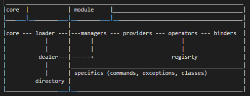

# RYN Server

RYN is a server prototype to manage differents data with a generic core.

## Getting Started

RYN Structure:



##### Core:
The core is compose of: core.py, loader.py, dealer.py, directory.py
    * core: lauch the program with a simple lifecycle (start, run, stop)
    * loader: load all module specifies in the config.json
    * dealer: manage exanges between the modules
    * directory: store all modules in which loaded by loader 

##### Modules : 
A module provide one or many differents data. His name begin with "mdl" and a prefix in lower case.

```
Exemple: name = "mdlmymodule", prefix = "mymodule"
```

In a module there are components.
There are five components types: a "manager", a "provider", an "operator", a "registry" and a "binder".
A module must have theses five components to be functionnal.
Each components have minimum one class. 
The class name must be in Camel Case to be correctly interpreted by RYN.
It will be formated like this:

```
Exemple: class MyModuleManager, class MyModuleProvider, class MyModuleOperator, class MyModuleRegistry, class MyModuleBinder
```

* Manager:
The manger is the first component of the module.
Define self.usage, self.command() 

* Provider:
The provider is the second component of the module.
It precise the provider you use to collect data 

* Operator:
The operator is the third component of the module.
It make an encapsulaton and apply calcul or format on the emitted data.

* Registry:
The registry is the fourth component of the module.
This is the brain of the module it be able to know which module have been request to subscribe from him.

* Binder:
The registry is the fifth component of the module.
It make the binding with "specifics" folder (your development).

#### Specifics Folder

The specific folder is your zone. You can create your data type and your communication with the outside world.

### Prerequisites

You must have a putty RAW console or a simple TCP client to connect on the server.

For begin you can clone the default module named 'mdldefault' to have a simple view on the behaviour.
It will be write in the console a text. 

### Installing

To install this server clone this project with the command: 

```
git clone https://gitlab.com/DodoT/server-prototype.git ryn-server
```

And 

```
cd ryn-server/
```

##### Linux

```
$ chmod 755 core.py clone.py remove.py
$ ./core.py
```

##### Windows

```
Double click on 'core.py'
```

If you run core.py you will have this in the console :

```
==== RYN => Initialize
[SUCCESS - BINDER - TERMINAL] : Connection (host: <your-ip>, port: 1297)
==== RYN => Run
```

Open the Simple TCP console with host and port.
This is the access point in the server for the moment.


## Running the tests

Explain how to run the automated tests for this system

### Break down into end to end tests

Explain what these tests test and why

```
Give an example
```

### And coding style tests

Explain what these tests test and why

```
Give an example
```

## Deployment

Add additional notes about how to deploy this on a live system

## Built With

* [Python36](https://www.python.org/downloads/) - Programming language
* [GitBash](http://gitforwindows.org/) - Git console on Windows

## Contributing

Please read [CONTRIBUTING.md](https://gist.github.com/PurpleBooth/b24679402957c63ec426) for details on our code of conduct, and the process for submitting pull requests to us.

## Versioning

We use [SemVer](http://semver.org/) for versioning. For the versions available, see the [tags on this repository](https://github.com/your/project/tags). 

## Authors

* **THIVOLLE Dorian** - *Initial work* - [DorianThiv](https://github.com/DorianThiv)

See also the list of [contributors](https://github.com/your/project/contributors) who participated in this project.

## License

This project is licensed under the MIT License - see the [LICENSE.md](LICENSE.md) file for details

## Acknowledgments

* Generics Systems
* Threading
* Servers
* SMA
* etc ...


